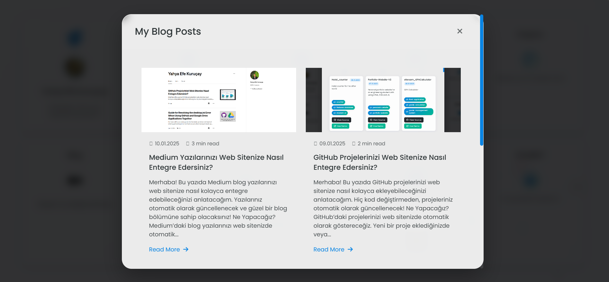

# Medium Blog Integration

This project allows you to showcase your Medium blog posts on your website. It creates an automatically updating, modern, and responsive blog section using RSS feed.



## 🚀 Features

- Medium RSS feed integration
- Modern and responsive card design
- Automatic image extraction
- Reading time calculation
- Caching system
- Animated gradient background
- Glassmorphism effects

## 📦 Installation

1. Clone the project:
```bash
git clone [https://github.com/username/medium-integration.git](https://github.com/efekurucay/Medium_integration_to_website)
```

2. Set your Medium username in `script.js`:
```javascript
const username = 'YOUR_MEDIUM_USERNAME';
```

3. Upload files to your web server or run on localhost.

## 🛠️ Technologies Used

- HTML5
- CSS3 (Modern features)
- JavaScript (ES6+)
- RSS2JSON API
- Bootstrap 5
- Font Awesome
- Google Fonts (Inter)

## 📝 Customization

### Background Colors
You can modify gradient colors in `styles.css`:

```css
body {
    background: linear-gradient(
        135deg,
        #667eea 0%,
        #764ba2 25%,
        #6B8DD6 50%,
        #8E37D7 75%,
        #667eea 100%
    );
}
```

### Card Design
You can customize blog cards' design in `styles.css`.

## 🔍 API Usage

RSS2JSON API offers 100 daily requests in the free plan. This limit is usually sufficient thanks to the caching system.

### Caching
- Data is stored in localStorage for 1 hour
- Automatic refresh system
- API limit protection

## 🎨 Design Features

- Animated gradient background
- Glassmorphism effects
- Hover animations
- Responsive design
- Modern typography

## 📄 License

MIT License - See [LICENSE](LICENSE) file for details.

## 🤝 Contributing

1. Fork the project
2. Create a feature branch (`git checkout -b feature/newFeature`)
3. Commit your changes (`git commit -am 'Add new feature: XYZ'`)
4. Push to the branch (`git push origin feature/newFeature`)
5. Create a Pull Request

## 📞 Contact

- Website: [efekurucay.com](https://efekurucay.com)
- GitHub: [@efekurucay](https://github.com/efekurucay)
- Medium: [@efekurucay](https://medium.com/@efekurucay)

## 🙏 Acknowledgments

- RSS2JSON API
- Bootstrap Team
- Font Awesome
- Google Fonts 
